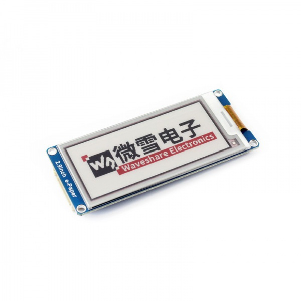

# Mongoose OS Demo app for the Waveshare E-paper display 2.9in (B)

## Overview

This is a skeleton app to demonstrate how to integrate the Waveshare EPD Demo code with Mongoose OS.

  
- EPD Module:
https://www.waveshare.com/wiki/2.9inch_e-Paper_Module_(B)
- Demo code: https://www.waveshare.com/wiki/File:2.9inch_e-paper_module_b_code.7z

## Pin configuration

### ESP32 (Espressif)

| EPD Module | | ESP32 |
|-|-|-|
| BUSY |  | 4 |
| RST |  | 16 |
| DC |  | 17 |
| CS |  | 5 |
| CLK |  | 18 |
| DIN |  | 23 |
| GND |  | GND |
| 3.3V |  | 3V3 |

## How to install this app

- Install and start [mos tool](https://mongoose-os.com/software.html)
- Switch to the Project page, find and import this app, build and flash it:

  

